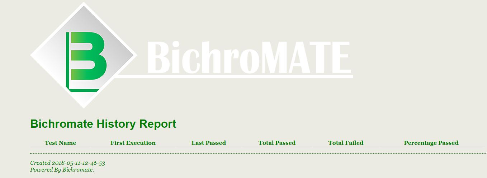
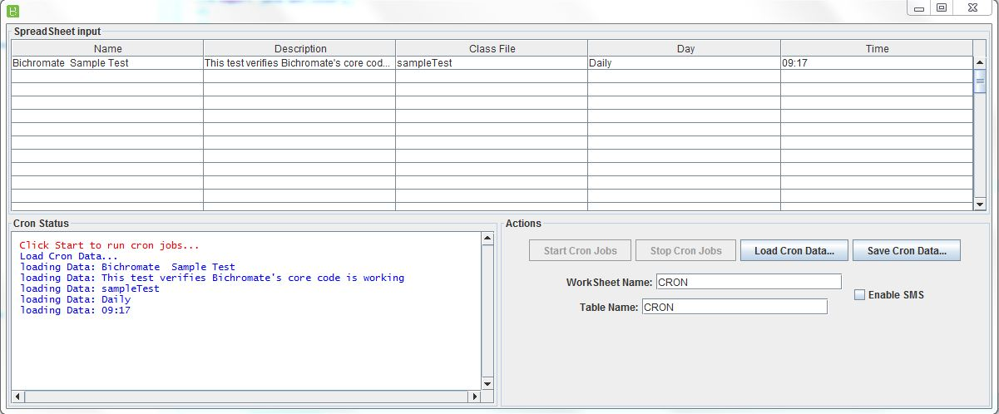
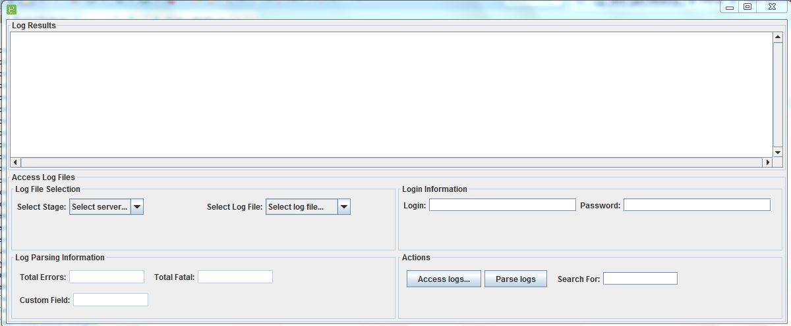


# BichroMate

Gum bichromate is a 19th-century photographic printing process based on the light sensitivity of dichromates. It is capable of rendering painterly images from photographic negatives. Gum printing is traditionally a multi-layered printing process, but satisfactory results may be obtained from a single pass. Any color can be used for gum printing, so natural-color photographs are also possible by using this technique in layers.

## Created By
David Ramer

8/9/2011

## Description
Like painting a picture, QA members want to create an automated testing environment that paints a picture of the stability of their product.  Bichromate uses the following tools: Java, Selenium, Appium, and TestNG to paint a testing framework that drives all automted testing. Page object model design and data driven tests are the concepts Bichromate incorporates to paint the product picture of quality.

## Usage

Create a new testNG project in Eclipse.

To access the webDrivers for local, proxy, SauceLabs, Browser Stack inherit from sTestWebDriverFactory

To gain access to the data driven tests and auto setup tunnels to Saucelabs and BrowserStack integrate your test classes with a new inherited sTestWebDriverFactory (make a copy of sTestWebDriverFactory, integrate your sTestWebDriverFactory)

To gain access to the base page object model design inherit sTestBasePageDeclaration

There are three log file factories used in Bichromate

POMLOGGER - used to capture any errors or messages in pages created for testing.

testExecutionLogFactory - captures results of all tests run.  When the @afterSuite is run, this logger generates a history report found in reports\reports.html

webDriverLogger - used to capture all usages of webDriver creation.

## Framework
BichroMate is built off the TestNG framework.

* TestNG - http://testng.org/doc/

## Reports
BichroMate generates the standard TestNG Reports along with Extend Reports and the build in BichroMate Report that captures histor of all tests run.

* First time the test was run
* Last time the test failed
* How many times has the test been run
* % Pass rate

## Tools
This sectin outlines the tools that are provided with BichroMate

* CronJob - Built in cronjob lets you schedule jobs on your local machine before promoting the tests to a CI environment like Jenkins or Team City

* LogFileFactory - Tool to parse log files after the test has run. You can also use the U/I to parse log files

## CI Integration

Running tests within a CI environment. Bichromate has the following system variables that will override the property files defaults

* -DBichromate.spreadsheet=stageTestSetup.xls
* -DBichromate.worksheet= X
* -DBichromate.table=x
* -DBichromate.logFileIP=35.162.206.134
* -DBichromate.dbServerName - server name to access the DataBase
* -DBichromate.dbName - DB schema name
* -Bichromate.sshServer - sshServer name

## 3rd Party Integrations
BichroMate integrates with SauceLabs, Browserstack, and the Selenium Grid. There is just one function call to create a webdrive that connects to these 3rd party integrations

* BrowserStack - https://www.browserstack.com/

* SauceLabs - https://saucelabs.com/

* Selenium Grid - https://www.seleniumhq.org/

## Updates 

# Updates
5/29/2018  BichroMate is now in the Maven Central Repo. To access it you use the following Dependencies

<dependency>
    <groupId>com.github.dramer</groupId>
    <artifactId>Bichromate</artifactId>
    <version>1.0.0</version>
</dependency>

7/11/2017  added bichromateJars folder. This contains the Bichromate jar files that need to be added to local mvn repo.

8/28/2016 initial version. Sample project coming soon.  Email DavidWRamer@yahoo.com for more information.

2) In Appium version 1.6 to find app elements you need do something like:
driver.findElementByXPath("//android.widget.Button[@text='+']").click();
