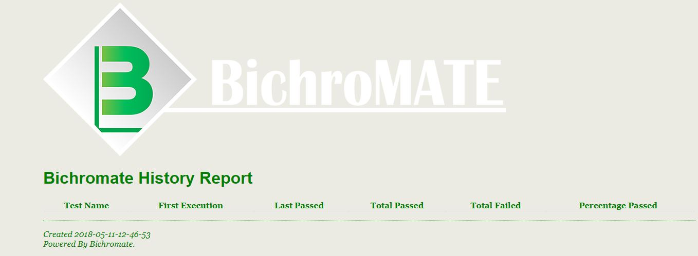
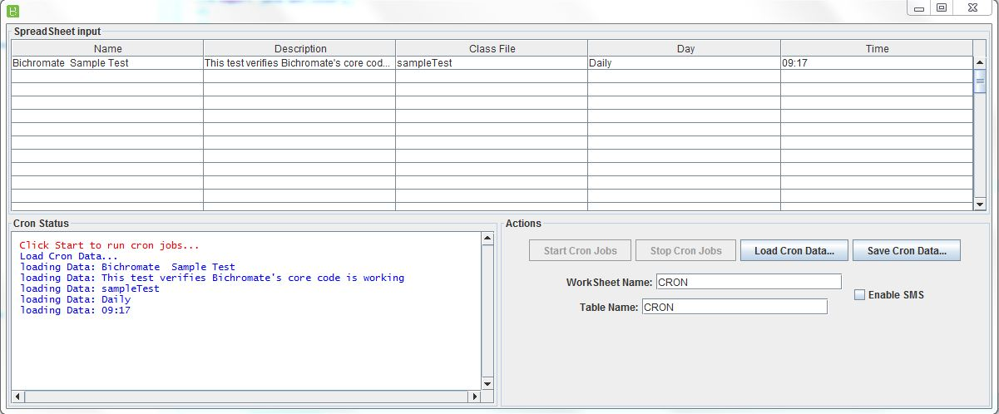
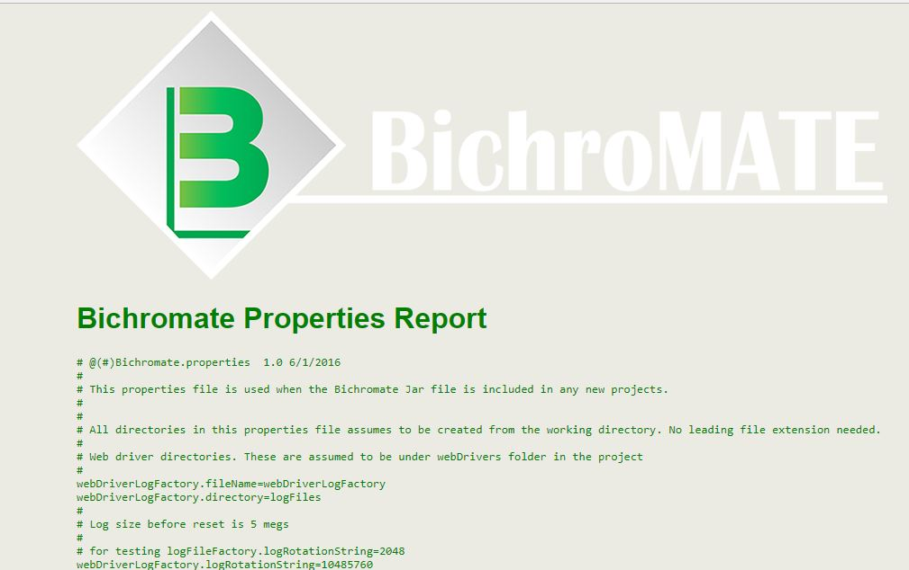

# BichroMate

Gum bichromate is a 19th-century photographic printing process based on the light sensitivity of dichromates. It is capable of rendering painterly images from photographic negatives. Gum printing is traditionally a multi-layered printing process, but satisfactory results may be obtained from a single pass. Any color can be used for gum printing, so natural-color photographs are also possible by using this technique in layers.

## Created By
David Ramer

8/9/2011

## Description
Like painting a picture, QA members want to create an automated testing environment that paints a picture of the stability of their product.  Bichromate uses the following tools: Java, Selenium, Appium, and TestNG to paint a testing framework that drives all automted testing. Page object model design and data driven tests are the concepts Bichromate incorporates to paint the product picture of quality.

## Usage

Create a new testNG project in Eclipse.

To access the webDrivers for local, proxy, SauceLabs, Browser Stack inherit from sTestWebDriverFactory

To gain access to the data driven tests and auto setup tunnels to Saucelabs and BrowserStack integrate your test classes with a new inherited sTestWebDriverFactory (make a copy of sTestWebDriverFactory, integrate your sTestWebDriverFactory)

To gain access to the base page object model design inherit sTestBasePageDeclaration

There are three log file factories used in Bichromate

POMLOGGER - used to capture any errors or messages in pages created for testing.

testExecutionLogFactory - captures results of all tests run.  When the @afterSuite is run, this logger generates a history report found in reports\reports.html

webDriverLogger - used to capture all usages of webDriver creation.

## Framework
BichroMate is built off the TestNG framework.

* TestNG - http://testng.org/doc/

## Reports
BichroMate generates the standard TestNG Reports along with Extend Reports and the build in BichroMate Report that captures histor of all tests run.

* First time the test was run
* Last time the test failed
* How many times has the test been run
* % Pass rate

## Tools
This sectin outlines the tools that are provided with BichroMate

* CronJob - Built in cronjob lets you schedule jobs on your local machine before promoting the tests to a CI environment like Jenkins or Team City

* Log File Factory - Tool used to scape log files after the test has run. There is also a U/I you can use to manually search log files.

## CI Integration

Running tests within a CI environment. Bichromate has the following system variables that will override the property files defaults

* -DBichromate.spreadsheet=stageTestSetup.xls
* -DBichromate.worksheet= X
* -DBichromate.table=x
* -DBichromate.logFileIP=35.162.206.134
* -DBichromate.dbServerName - server name to access the DataBase
* -DBichromate.dbName - DB schema name
* -Bichromate.sshServer - sshServer name

## 3rd Party Integrations
BichroMate integrates with SauceLabs, Browserstack, and the Selenium Grid. There is just one function call to create a webdrive that connects to these 3rd party integrations

* BrowserStack - https://www.browserstack.com/

* SauceLabs - https://saucelabs.com/

* Selenium Grid - https://www.seleniumhq.org/

## Mobile Testing
BichroMate uses Appium to support mobile testing

* Mobile Testing using Appium webdriver - http://appium.io/

## Windows Application Testing
BichroMate integrates Winium web drive to test native Windows Applications

* Winium web Driver - https://github.com/2gis/Winium

## Updates 

# 5/15/2018
* Updated the readme in BichroMate Sample and BichroMate projects.
* Moved the fluent wait and implicit and explicit waits into the base object class

# 5/14/2018
* Added a TestDataFactory to store test results that can be used by any test. This is a Hash table of any data.

# 4/26/2018
* Upgraded to 3.11.0 of Selenium
* Added sTestKibanaFactory - still work in progress
* Added sTestNewRelicFactory - still work in progress

# 7/27/2017
Added Winium WebDriver to test Windows applications. Works a little different than creating a web driver thru sTestWebDriverFactory.  You create the base application class. From the base application class you build your POM just like testing a web site.  See the test application in src\test\java\sample

Added Action function to the base Object Model. You now pass in the web driver and the element. The action function allows you to
* Double click an element
* Right clich an element
* Hover over an element

# 6/18/2017
Added a HTTP Server very similar to Selenium grid. When tests start to run the Bichromate HTTP server runs and you can go to local host and see the following information. this is an easy way to change properties files.

* http://localhost:8000/reports?reportName=<fileName> Opens the Bichromate History Report
* http://localhost:8000/properties You will see all the properties for Bichromate
* http://localhost:8000/propertiesForm You will see a form to edit Bichromate properties
* http://localhost:8000/ExtendReport You will see the Extend Reports
* http://localhost:8000/TestNGReports You will see the testNG Report
* http://localhost:8000/ redirected to http://www/bichromate.org

# 5/24/2017
Complete overhaul of the Selenium object types (button, link, text, table). The POM never has to write methods to cover the objects on the page. You simple create new base object types.

OLD WAY:   wedriver.getPageX().clickLogin();  - where clickLogin was a method written specifically for the page.

NEW WAY:  webdriver.getPageX().getLoginButton().clicksTestobjectType();

Easier and simple way to build POMs.

Check out the sample test.

# 4/11/2017
Bichromate 3.0 (Master) has been tested with Selenium 3.3.1 webDrivers. This has only been tested on Windows 7 64 bit testing with Firefox (Latest Version), IE 10.0.9200.17609, and Chrome Version 57.0.2987.133
This has not been tested on MAC and Safari, or Linux.

# 4/6/2017
Bichromate 3.0 will support Selenium 3.x(Master Branch). The Bichromate team will continue to support Bichromate 2.x (on the Bichromate 2.46 Branch) until the end of the year.

# 2/8/2017
Added the Microsoft SQL ODBC driver to the plugins directory. You need to manually add the jar file to your maven repo. You do that by following these steps.

* Download sqljdbc4.jar from the Microsoft website to your local machine.
* Right click on Project-->Import-->Maven-->Install or deploy an artifact to a Maven repository as shown below.
* Next-->Fill the following details

* Artifact file: path of the jar you downloaded (Ex: E:\lib\sqljdbc4.jar in my case) 
* Group Id: com.microsoft.sqlserver
* Artifact Id: sqljdbc4
* Version: 4.0
* Then Refresh/clean the project. 

# 12/30/2016

Added a new Factory: sTestZipCodeAPI
This factory can be accessed thru the sTestWebDriverFactory. It provides the following APIS
* findZipCodeLocation(String zipCode) returns the lat,lng city,state,timezone 
* zipCodesFromCityState(String city, String state) returns the zipcodes for a city state 
* zipCodeByRadius(String zipCode, String radius) returns all city and zipcodes from a given zipcode and radius. Radius is in miles
* getDistanceInMiles(String zipCodeFrom, String ZipCodeTo) returns distance in miles between two zip codes
* getDistanceInKilometers(String zipCodeFrom, String ZipCodeTo) returns distance in Kilometers between two zip codes

# 8/9/2016

Added the pom.xml file

Added a factory to generate page object model java files from a properties file

Added a password log manager. Tests store all passwords in the passwords.log file (Encrypted)

Added a FTP factory to push reports to a FTP site

Added Extend Reports

Added Bichromate History report

# My Notes

## Add file/changed file to repository

Git add file or directory 

Git commit -m "notes" 

git push -u origin master 

git remote add origin https://github.com/dramer/Bichromate.git

## Steps to remove directory

git rm -r --cached FolderName

git commit -m "Removed folder from repository"

git push origin master

## resolving conflicts

git add and commit all your local changes

git pull will try to auto fix conflicts

if there are conflicts, open the file and fix them, then git add, git commit the file

git push -u origin master

## Remove a file

git rm file1.txt
git commit -m "remove file1.txt"
git push origin <branch_name>  

## Creating a New project

# Windows/Mac

Pre-requisites
1. Git
2. Eclipse, with TestNG and Maven plugin 
3. Java JDK 1.8+
4. Maven 3.0.0+

Steps
1. type git clone https://github.com/dramer/Bichromate.git
2. Open Eclipse. Right-click Import Existing Maven Project -> Next
3. Select the project directory that contains the pom.xml. Click Finish to import this project.
4. Click ALT-F5, then select your project and OK button to update Maven project.

## Running Tests in the CI Environment

1. open console
2. go to project directory
3. execute mvn clean test

# Bichromate Build

1. Open console and navigate to the Bichromate project directory
2. Execute "mvn clean package -Dmaven.test.skip" to create a new Bichromate jar file
3. New Bichromate jar file is  located in Bichromate\target

# Installing Bichromate into your local repo

1. mvn install:install-file -Dfile=<target from sample project>

# Running WebDriver for IE

1. you need to configure Internet Options, security tab:
    A) Internet
        a) Security level is Medium-High
        b) Enabled Protected Mode is check box is checked
    B) Local Internet
        a) Security level is Medium-High
        b) Enabled Protected Mode is check box is checked
    B) Trusted Sites
        a) Security level is Medium-High
        b) Enabled Protected Mode is check box is checked
2) IE capabilities need to be set:
	A) caps.setCapability(InternetExplorerDriver.INTRODUCE_FLAKINESS_BY_IGNORING_SECURITY_DOMAINS,true);
	B) caps.setCapability(InternetExplorerDriver.IGNORE_ZOOM_SETTING,true);
	C) caps.setCapability(InternetExplorerDriver.NATIVE_EVENTS,false);
	D) caps.setCapability(InternetExplorerDriver.UNEXPECTED_ALERT_BEHAVIOR, "accept");
	E) caps.setCapability("ignoreProtectedModeSettings", true);
	F) caps.setCapability("disable-popup-blocking", true);
	G) caps.setCapability(InternetExplorerDriver.ENABLE_PERSISTENT_HOVERING, true);

# Mobile Automation using Appium

1. Follow this link to setup NPM, NodeJS, and Appium.  http://appium.io/slate/en/master/#setup
2. Make sure your device is connected via USB to your local machine. Ensure the physical device is in Debug mode
   First Enable Developer Option, To enable Developer Option in android device, Click on Settings and find out ‘About Phone’ option.        Click 'Version Number'. Then click the build number 7 times, message will display about being in Developer mode.
3. Once Appium is running you can then use Bichromate to obtain IOS and or Android webDriver.
4. More to come when This is running

# Connecting IOS Devices to MAC
1) Need Xcode Installed
2) Need Node JS, this will install NPM
3) Install Appium, as root, npm --install -g appium
4) npm install -g appium-xcuitest-driver
5) Connect your device IPHONE 6 was tested
6) Launch XCODE into the playground.
7) Under the "Window" menu click devices. From the Devices window the connected phone should be displayed. There you will find the Identifyer for setting up the Capabilities

# Connecting Android Device to Windows

1) The only way I've gotten this to work is by following the Android SDK setup: http://visualgdb.com/KB/usbdebug-manual/
2) As of 6/5/2017 there is a command line version of the Appium server and there is a windows U/I version. The command line version is 1.6 and is the latest version being worked on. Don't use the Windows version 1.4.16. There is a Beta version of the Windows U/I of Appium but I would stick with the Appium command line version.

# How to Install and run the Command Line Version of the Appium server.

1) Node Js needs to be installed. This will also install npm
2) Install the Appium server by calling from the command line:  
     $ npm install -g appium
     
     $ appium --address 127.0.0.1 --port 4723 
     
# Appium Capabilities and Usage

1) http://appium.io/slate/en/master/?ruby#appium-server-capabilities

# General Appium Help and Information

1) Reset the Galaxy S8 http://www.geeksquad.co.uk/articles/how-to-factory-reset-your-samsung-galaxy-s8
2) Setup Developer Mode on Galaxy:  http://androidcure.com/enable-developer-options-samsung-galaxy-s8-plus/
3) Great way to find the appPackage and appActivity:  http://www.automationtestinghub.com/apppackage-and-appactivity-name/

# Finding Elements

1) Use the UIAutomator - you might have to change the uiautomatorviewer.bat. Look for the following line:  call "%java_exe%" "-Djava.ext.dirs=%javaextdirs%" "-Dcom.android.uiautomator.bindir=C:\XXXX\SDK\tools" -jar %jarpath% %*

2) In Appium version 1.6 to find app elements you need do something like:
driver.findElementByXPath("//android.widget.Button[@text='+']").click();
